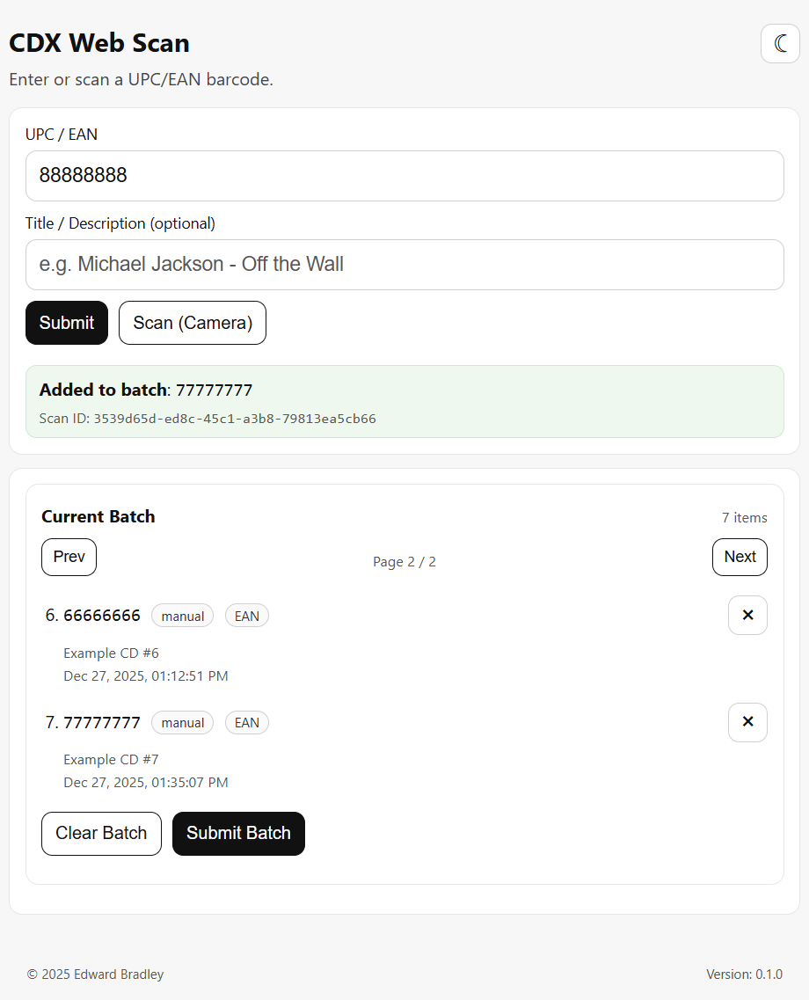
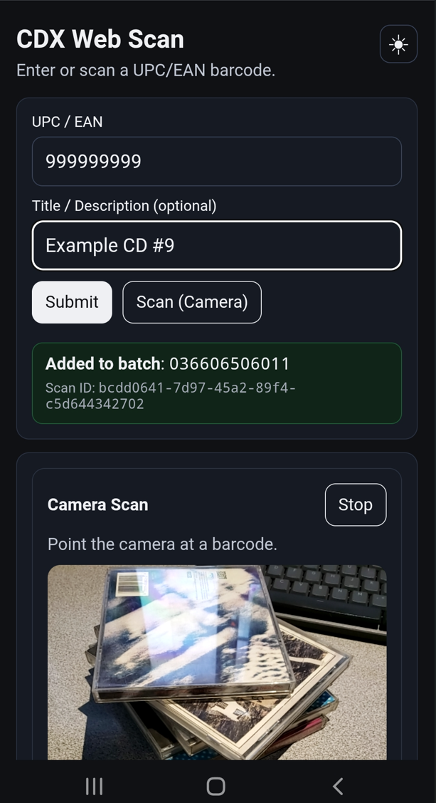
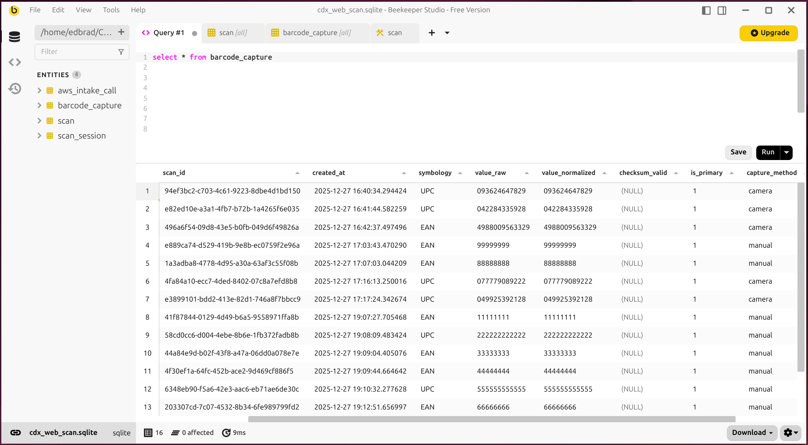

# CDX Web Scan  
**Internal Intake & Scan Application (PWA)**

## Overview

`cdx-web-scan` is the **internal-facing intake application** for the CDX platform.  
It provides a mobile-friendly, utility-first interface for capturing physical “widgets” (CDs) and submitting them into an enterprise-style intake pipeline.

<table>
  <tr>
    <td>
      
    </td>
    <td>
      
    </td>
  </tr>
</table>

While CDs are the concrete input, this application is intentionally designed to model a **generic enterprise intake UI**, similar to those used for:

- inventory receiving
- asset onboarding
- order entry
- warehouse intake
- document capture systems

The focus is on **intake mechanics, batching, validation, and durability**, not media playback.

---

## Purpose

The primary goal of `cdx-web-scan` is to model the **front edge of an enterprise intake workflow**:

> **Capture → Validate → Batch → Submit → Queue**

It is optimized for **speed, accuracy, and operational efficiency**, rather than rich client-side behavior.

---

## Key Responsibilities

- Mobile-friendly **Progressive Web App (PWA)** interface
- Camera-based barcode scanning
- Manual barcode entry fallback
- Batch intake sessions
- Intake metadata and tagging
- Submission of validated intake jobs to the cloud intake API
- Clear operator feedback (accepted / rejected / pending)

---

## What This App Is *Not*

- ❌ A public-facing application  
- ❌ A streaming or playback interface  
- ❌ A heavy single-page application (SPA)  

This is an **internal utility**, intentionally simple and task-focused.

---

## Technology Stack

### Application Layer
- **Python**
- **Flask**
- **HTMX**
- **Jinja2 templates**

### Tooling
- **uv** (dependency management + running dev/test commands)

### Front-End Behavior
- **Minimal JavaScript**
  - Camera access
  - Barcode decoding
  - PWA support
- Server-rendered HTML with HTMX-driven updates

### PWA Features
- Installable on mobile devices
- App manifest and service worker
- Offline-aware design (future phase)

---

## Deployment Model

- Runs **on-prem / homelab**
- Served behind **NGINX**
- Externally accessible only via **NetBird (Zero Trust VPN)**
- No public exposure
- Communicates outbound to the cloud intake API

This mirrors modern enterprise patterns where **intake tools are private, internal systems**.

---

## Database

`cdx-web-scan` maintains a **local SQLite database** to support durability and operational recovery.

It is used to store:

- **Original scan events** captured by operators (source, timestamps, notes, barcodes)
- **AWS Intake API call history** (payload/attempt/status) for tracking, recovery, and troubleshooting



---

## Docker Deployment (Gunicorn + NGINX)

This repo includes a production-oriented Docker setup:

- Gunicorn runs the Flask app in the `app` container
- NGINX runs as a reverse proxy + TLS terminator in the `nginx` container
- HTTPS is exposed on `443` (self-signed certificate)
- HTTPS is required for mobile browser camera access (secure context)
- Optional plain HTTP is exposed on `8080` and redirects to HTTPS
- SQLite DB + logs persist to a host folder via a bind mount

### Deploy from scratch (Linux)

Assumptions:

- Docker + Docker Compose are installed
- Host ports `443` and `8080` are available

1) Copy the environment template:

```bash
cp .env.example .env
```

2) Edit `.env` and set (at minimum):

- `SECRET_KEY`
- `INTAKE_API_URL` (+ optional `INTAKE_API_TOKEN`) 

3) Set host persistence + permissions (recommended):

- `CDX_WEB_SCAN_HOST_DATA_DIR` (host folder where SQLite DB + logs will be written)
- `CDX_WEB_SCAN_UID` / `CDX_WEB_SCAN_GID` (so persisted files are owned by your host user)

Example values:

```bash
CDX_WEB_SCAN_HOST_DATA_DIR=/home/you/CDX-Web-Scan
CDX_WEB_SCAN_UID=1000
CDX_WEB_SCAN_GID=1000
```

Create the folder:

```bash
mkdir -p "${CDX_WEB_SCAN_HOST_DATA_DIR}"
```

4) Create a self-signed TLS certificate for NGINX:

```bash
mkdir -p deploy/certs
openssl req -x509 -newkey rsa:2048 -sha256 -days 3650 -nodes \
  -keyout deploy/certs/cdx-web-scan.key \
  -out deploy/certs/cdx-web-scan.crt \
  -subj "/CN=localhost" \
  -addext "subjectAltName=DNS:localhost,IP:127.0.0.1"
```

5) Build and start:

```bash
docker compose --env-file .env up -d --build
```

The app will be available via NGINX:

- `https://<server-ip>/` (self-signed cert)
- `http://<server-ip>:8080/` (redirects to HTTPS)

### Updating

```bash
git pull
docker compose --env-file .env up -d --build
```

### Testing

This repo includes a small `pytest` suite (smoke tests + basic DB test).

Project tooling uses `uv`, so tests are run via `uv run ...`.

Run tests locally:

```bash
uv run --group dev pytest -q
```

Notes:

- Tests force the app to use a temporary folder for SQLite + logs, so they do not touch your external persistence directory.

### Full reset (wipe containers + external DB/logs)

```bash
docker compose --env-file .env down --volumes --remove-orphans --rmi local
rm -rf "${CDX_WEB_SCAN_HOST_DATA_DIR}"
mkdir -p "${CDX_WEB_SCAN_HOST_DATA_DIR}"
docker compose --env-file .env up -d --build
```

---

## Role in the CDX Platform

`cdx-web-scan` is one of four deployment-aligned components in CDX:

**[ cdx-web-scan ]** → [ cdx-intake-api ] → [ cdx-enrich-worker ]  → [ cdx-web-user ]


This separation ensures:
- clear security boundaries
- independent scaling
- realistic enterprise architecture modeling

---

## Enterprise Pattern Modeled

This repository intentionally models an **enterprise intake / receiving application**, such as:

- warehouse receiving UI
- asset registration portal
- order intake system
- document ingestion front-end

The use of CDs is incidental; the **workflow and architecture** are the core focus.

---

## Repository Structure (Initial)

```.
├── cdx_web_scan
│   ├── error_pages
│   │   └── __pycache__
│   ├── __pycache__
│   ├── static
│   │   └── img
│   ├── templates
│   │   └── error_pages
│   └── web_scan
│       └── __pycache__
├── deploy
│   └── certs
├── docs
├── migrations
│   ├── __pycache__
│   └── versions
└── __pycache__

```

---

## Roadmap

### Phase 1 (Current)
- Vision and UX definition
- Repository scaffolding
- Branding and UI mockups

### Phase 2
- Camera-based barcode scanning
- Batch intake sessions
- Intake API integration
- Operator feedback and validation

### Phase 3
- Offline-aware batching
- Enhanced intake metadata
- Error handling and retry visibility

See `docs/roadmap.md` for details.

---

## Design Philosophy

> **Boring, predictable, and reliable — in the best possible way.**

This application favors:
- clarity over cleverness
- server-rendered HTML over heavy client frameworks
- explicit workflows over implicit magic

These are deliberate choices aligned with how real enterprise intake systems are built and maintained.

---

## License

MIT License


